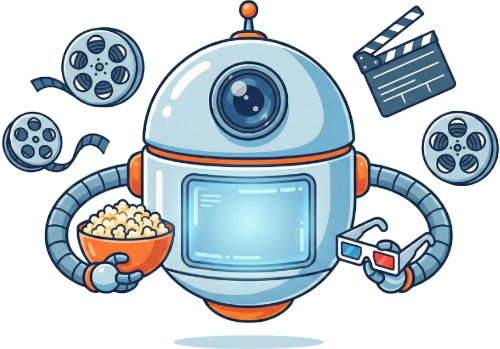

# 🎬 AI Film & Dizi Öneri

Yapay zeka destekli kişiselleştirilmiş film ve dizi öneri platformu. Google Gemini AI kullanarak ruh halinize, tercihlerinize ve izleme geçmişinize göre size özel öneriler sunar.

## 🌐 Demo

👉 https://gurkangurdal.github.io/Dizi_Film_AI_Oneri/

## ✨ Özellikler

- 🤖 **AI Destekli Öneriler** - Google Gemini AI ile akıllı öneri sistemi
- 🎭 **Ruh Hali Bazlı Öneriler** - Mutlu, hüzünlü, heyecanlı gibi ruh hallerine göre içerik
- 📁 **Kategori Seçimi** - Aksiyon, komedi, drama, bilim kurgu ve daha fazlası
- 🎬 **Film & Dizi Desteği** - Her iki içerik türü için öneriler
- 💬 **Doğal Dil Sorguları** - "Geçen hafta The Office bitirdim, benzer bir şey öner" gibi
- 📱 **Responsive Tasarım** - Mobil ve masaüstü uyumlu
- ✨ **Modern UI/UX** - Glassmorphism efektleri ve akıcı animasyonlar
- 📜 **Öneri Geçmişi** - Geçmiş önerilerinizi görüntüleyin

## 🖼️ Ekran Görüntüleri

<div align="center">
  
</div>

## 🛠️ Teknolojiler

### Frontend
- HTML5, CSS3, JavaScript (Vanilla)
- CSS Animations & Keyframes
- Glassmorphism UI Design
- Responsive Design

### Backend
- Node.js & Express.js
- Google Gemini AI API
- CORS & dotenv

## 🚀 Kurulum

### Gereksinimler
- Node.js 18.0.0 veya üzeri
- Google Gemini API anahtarı

### Adımlar

1. **Repoyu klonlayın**
```bash
git clone https://github.com/GurkanGurdal/Dizi_Film_AI_Oneri.git
cd Dizi_Film_AI_Oneri
```

2. **Backend bağımlılıklarını yükleyin**
```bash
cd server
npm install
```

3. **Ortam değişkenlerini ayarlayın**
```bash
cp .env.example .env
```
`.env` dosyasını düzenleyip Gemini API anahtarınızı ekleyin:
```
GEMINI_API_KEY=your_api_key_here
PORT=5000
```

4. **Sunucuyu başlatın**
```bash
npm start
```

5. **Frontend'i açın**
- `index.html` dosyasını tarayıcıda açın

## 🎨 Öne Çıkan Tasarım Özellikleri

- **Glassmorphism** - Buzlu cam efektli modern kartlar
- **Gradient Animasyonları** - Akıcı renk geçişleri
- **Robot Maskot** - 3D görünümlü arama animasyonu (3 farklı açı)
- **Hover Efektleri** - İnteraktif buton ve kart animasyonları
- **Responsive Layout** - Tüm cihazlara uyumlu tasarım

## 📝 Kullanım

1. İçerik türünü seçin (Film/Dizi)
2. Kategorileri işaretleyin (isteğe bağlı)
3. Ruh halinizi seçin (isteğe bağlı)
4. İsterseniz özel bir istek yazın
5. "AI'dan Öneri İste" butonuna tıklayın
6. AI'ın size özel önerilerini görün!

## 👨‍💻 Geliştirici

**Gürkan Gürdal**

- GitHub: [@GurkanGurdal](https://github.com/GurkanGurdal)

---

<div align="center">
  <p>⭐ Bu projeyi beğendiyseniz yıldız vermeyi unutmayın!</p>
</div>

